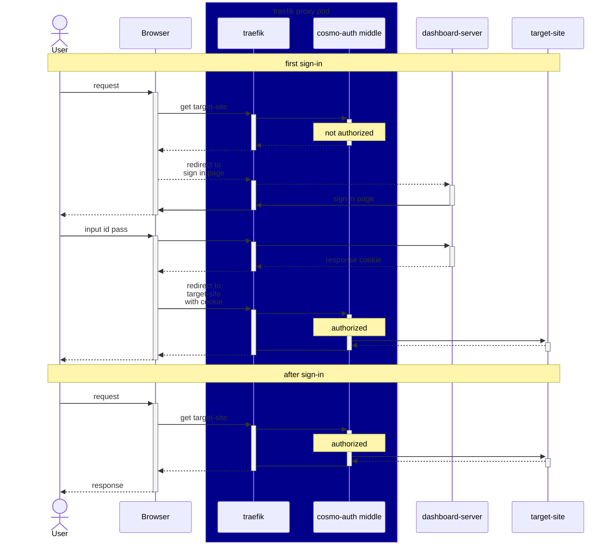

## Open target-site on first Sign-in

```mermaid
sequenceDiagram
    actor User
    participant Browser
    box darkblue traefik proxy pod
        participant traefik
        participant cosmo-auth middle
    end
    participant dashboard-server
    participant target-site

Note over User,target-site: first sign-in

    User ->> + Browser : request
        Browser ->> + traefik : get target-site
            traefik ->> + cosmo-auth middle : 
            Note over cosmo-auth middle: not authorized
            cosmo-auth middle -->> -  traefik : 
        traefik -->> -  Browser : 
        Browser -->> + traefik :  redirect to<br/>sign in page
            traefik -->> + dashboard-server : 
            dashboard-server ->> - traefik : sign in page
        traefik ->> - Browser : 
    Browser -->> - User : 

    User ->> + Browser : input id pass
        Browser ->> + traefik : 
            traefik ->> + dashboard-server : 
            dashboard-server -->> -  traefik : response cookie
        traefik -->> -  Browser : 

        Browser ->> + traefik : redirect to<br/>target-site<br/>with cookie
            traefik ->> + cosmo-auth middle : 
                Note over cosmo-auth middle: authorized
                cosmo-auth middle ->> + target-site : 
                target-site -->> - cosmo-auth middle :  
            cosmo-auth middle -> - traefik : 
        traefik -->> - Browser : 
    Browser -->> - User : 


Note over User,target-site: after sign-in
    User ->> + Browser : request
        Browser ->> + traefik : get target-site
            traefik ->> + cosmo-auth middle : 
                Note over cosmo-auth middle: authorized
                cosmo-auth middle ->> + target-site : 
                target-site -->> - cosmo-auth middle :  
            cosmo-auth middle -> - traefik : 
        traefik -->> - Browser : 
    Browser -->> - User : response
```

