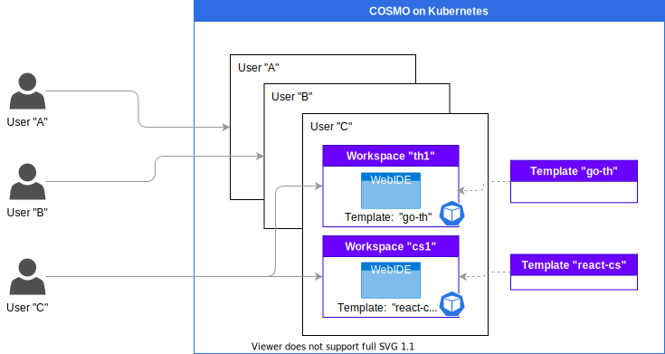

# COSMO

Bring Cloud-native power to Team Development.

A lightweight WebIDE and DevEnvironment containers manager on Kubernetes. COSMO is not WebIDE but WebIDE management platform.

<video src="https://user-images.githubusercontent.com/9918931/136062440-5d6df8e6-8269-4248-873e-471fa127c06e.mp4"></video>

# Concepts and Features
- **DevEnvironment as Code** :

  - Define Workspace Container and its deployment configurations as Template. 
  - Easily create Workspace by the template for each developers.

- **Any container image for Workspace container** :
    
  - No limit for workspace container. You can use any existing great WebIDE container such as [`cdr/code-server`](https://github.com/cdr/code-server) or [`eclipse/theia`](https://github.com/eclipse-theia/theia) or yours based on them.

  - Bring your own WebIDE image that contains your favorite development tools or utilities and your team specific development configurations.

- **Developers Friendly** :

  - `COSMO Dashboard GUI` is included by default. It is designed to be  developers-friendly who are not familier with Kubernetes.
  - Developers can create their own workspace by some clicks. 

- **Dynamic Resource Assignment** : 

  - Developers can create their own Workspaces as needed. Also, Workspace containers can be suspended (not deleted) for saving the server resources.

- **Dynamic and Auto-Configuration of Workspace Network** : 

  - Developers can open development server ports dynamically such as `webpack-dev-server` by GUI or CLI. COSMO configure Workspace networks automatically.

- **Auto authentication for all access to Workspace** : 

  - `COSMO Auth Proxy` watches all of the workspace’s exposed ports and automatically attaches reverse proxy to the ports for authentication.
  - Developers do not have to mind about a security of Workspace dev server’s ports and Workspace itself.

- **Kubernetes-native** :

  - Reap the benefits of cloud natives in the development process through Kubernetes.
  - For Kubernetes administrator, you can also manage development environments with Gitops or other general Kubernetes configuration management.

- **No database, easy to maintain** :

  - COSMO requires NO database. User data or Workspace state is stored natively in Kubernetes.
  - You can maintain the state of Workspaces by existing Kubernetes management solutions.

- **Run Anywhere** : 

  - COSMO can be installed on any Kubernetes cluster on public clouds or private servers etc.
  - COSMO does not require any public reachability if you already have your Kubernetes cluster and prepared container images to your registry.

- **Easy Install** : 

  - If you already have a Kubernetes Cluster, you can install COSMO in just a few steps.

# Background

For app project newcomers, setting up a development environment is the first barrier that requires time and effort.

It is important to be able to run the app quickly to understand what it is or how it works and to begin modifying the codes as soon as possible.

Today, with the advancement of WebIDEs such as [`cdr/code-server`](https://github.com/cdr/code-server) and [`eclipse/theia`](https://github.com/eclipse-theia/theia), it is possible to develop in the browser comparable to an IDE installed on a PC.

Based on the WebIDE containers, you can build your own container image with the programming language, language server, and necessary packages, development tools, and extensions installed.

Once you write Dockerfile, you can desceibe your development requirements and it is reproducible.

In the next steps, however, you need to deploy the containers and configure the container volumes and networkings such as load balancers or Ingress. 

These tasks are very environment-dependent, and most teams have their own environment setup procedures. Each time a new developer joins, these bothersome steps need to be done.

There are existing products for this issue and they are great and have a lot of features.
But they are little bit too rich and require too much knowledge for developers to build and maintain a product environment.

This is the motivation of COSMO. To compare with the similar products, see the section [Comparison with other WebIDE products](https://github.com/cosmo-workspace/cosmo#comparison-with-other-webide-products)

# Getting Started

See [GETTING-STARTED.md](https://github.com/cosmo-workspace/cosmo/blob/main/docs/GETTING-STARTED.md)

# How it works

## Concepts

COSMO has 3 main resources.

- `User`: Workspace running environment for each developers. In Kubernetes terms, it is a [`Namespace`](https://kubernetes.io/docs/concepts/overview/working-with-objects/namespaces/) actually.
- `Workspace`: Workspace is containers and networks for WebIDE Containers. You can create several Workspaces and use properly for each your developing apps or projects.
- `Template`: Template of Workspace. Workspace is a instance of WebIDE Containers created by Template.

### COSMO Template Engine

COSMO has its own Template engine that is simple and optimized for the reproducibility of Workspace.

The core ideas are `Template` and `Instance`, which are defined as custom resources in Kubernetes. 

- `Template` is a collection of standard Kubernetes YAML configurations (Deployment including the WebIDE container, Ingress, Service and PersistentVolumeClaims, etc.). In other words, it's like a Workspace skeleton or boilerplate.

- `Instance` is a instance of the Template. By creating an Instance, the resources defined in the Template will be created with dynamic information.
`Workspace` is a wrapper resource of `Instance` that is specifically for use with WebIDE containers.

COSMO Template engine is picking the best of both overlay-based [`Kustomize`](https://github.com/kubernetes-sigs/kustomize) and variable-based [`Helm`](https://helm.sh).

`Template` has variables. It is a minimal feature for text-based YAML replacement, so that you do not need to understand the detailed syntax.

Also supports overriding fixed configuration values in `Instance`. 
For example, it is used for dev server ports that are opened dynamically during development.

See the details in [CRD-DESIGN.md](CRD-DESIGN.md)

## System Components

COSMO consists of System-side Components, Workspace-side Components and Utilities.

- **System-side Components** :
  - `COSMO Controller Manager`: Kubernetes Controller watching the custom resource `Workspace`, `Instance` and `Template`.
  - `COSMO Dashboard`: GUI console for `Workspace` to create/delete/update etc. For admin, it can be used for User management.

- **Workspace-side Components** :
  - WebIDE Container: main WebIDE container for development. Bring your own image.
  - `COSMO Auth Proxy`: A reverse proxy with authentication. Watches the WebIDE ports and automatically attaches proxies with authentication to the ports.

- **Utilities**:
  - `cosmoctl`: A command line utility for managing COSMO resources. It allows you to do the same task with COSMO Dashboard by CLI.

# Comparison with other WebIDE products

## Open Source WebIDE projects

These are NOT comparable to COSMO; **COSMO supports hosting these WebIDE containers**.

| Projects | Description | Use in COSMO | Official Docker Hub |
|:---|:---|:---|:---|
| [`cdr/code-server`](https://github.com/cdr/code-server) | Project of VS Code in the browser. | ✅ | [`codercom/code-server`](https://hub.docker.com/r/codercom/code-server) |
| [`eclipse/theia`](https://github.com/eclipse-theia/theia) | A cloud IDE framework implemented in TypeScript. | ✅ | [`theiaide/theia`](https://hub.docker.com/r/theiaide/theia) |

We recommend that you build your own Development Container Image based on these official Docker images.
(with your programming language, language server, and necessary packages, development tools, and extensions)

## Similar SaaS or Self-hosted WebIDE platform products

COSMO is not WebIDE but **Self-hosted WebIDE management platform**.
It is targeting a team development for multiple workspaces for each team members.

| Name | SaaS | Self-hosted | Subscription (including free plan) | Team management | Description | 
|:---|:---|:---|:---|:---|:---|
| **COSMO** | - | ✅ | - | ✅ For team | Lightweight WebIDE and DevContainer Manager on Kubernetes | 
| [`Eclipse Che`](https://www.eclipse.org/che/) | ✅ (RedHat) | ✅ | - | ✅ For team | The Kubernetes-Native IDE for Developer Teams | 
| [`Coder`](https://coder.com/) | ✅ (Coder) | ✅ | Yes | ✅ For team | The developer workspace platform. Move development to your cloud | 
| [`Gitpod`](https://www.gitpod.io/) | ✅ (Gitpod) | ✅ | Yes | ✅ For team | Spin up fresh, automated dev environments for each task, in the cloud, in seconds. | 
| [`AWS Cloud9`](https://aws.amazon.com/cloud9/) | ✅ (AWS) | - | Yes | ⚠️ Single developer (Coraborate with other feature) | A cloud IDE for writing, running, and debugging code | 
| [`Google Cloud Shell Editor`](https://cloud.google.com/shell) | ✅ (Google Cloud) | - | Yes | ⚠️ Single developer (Coraborate with other feature) | Manage your infrastructure and develop your applications from any browser. | 
| [`GitHub Codespaces`](https://github.com/features/codespaces) | ✅ (GitHub) | - | Yes | ⚠️ Single developer (Coraborate with other feature) | Blazing fast cloud developer environments. Visual Studio Code backed by high performance VMs that start in seconds. |

## Comparison with Self-hosted products

Existing products are great, but they are little bit too rich and require too much knowledge for developers to build and maintain a product itself environment.

| Name | Subscription (including free plan) | Database required | Dynamic dev server network | Workspace Authentication | Dynamic Port Authentication | Running System Components | Running Workspace Components |
|:---|:---|:---|:---|:---|:---|:---|:---|
| **COSMO** | - | **No database required** | ✅ | ✅ | ✅ | **Only** [Controller Manager](https://github.com/cosmo-workspace/cosmo/pkgs/container/cosmo-controller-manager) and [Dashboard](https://github.com/cosmo-workspace/cosmo/pkgs/container/cosmo-dashboard) | **Only** Your WebIDE and [Auth Proxy](https://github.com/cosmo-workspace/cosmo/pkgs/container/cosmo-auth-proxy) |  
| [`Eclipse Che local install`](https://www.eclipse.org/che/) | - | Yes (Postgres) | - | [✅](https://www.eclipse.org/che/docs/che-7/administration-guide/authenticating-users/) | - | [Che server](https://www.eclipse.org/che/docs/che-7/administration-guide/che-workspace-controller/#che-server_che), [Che user dashboard](https://www.eclipse.org/che/docs/che-7/administration-guide/che-workspace-controller/#che-user-dashboard_che), [Che Devfile registry](https://www.eclipse.org/che/docs/che-7/administration-guide/che-workspace-controller/#che-devfile-registry_che), [Che plug-in registry](https://www.eclipse.org/che/docs/che-7/administration-guide/che-workspace-controller/#che-plug-in-registry_che), [Che and PostgreSQL](https://www.eclipse.org/che/docs/che-7/administration-guide/che-workspace-controller/#che-postgresql_che) and [Che and Keycloak](https://www.eclipse.org/che/docs/che-7/administration-guide/che-workspace-controller/#che-keycloak_che) | [Che Plugin](https://www.eclipse.org/che/docs/che-7/administration-guide/che-workspaces-architecture/#che-plug-ins_che), [Che Editor](https://www.eclipse.org/che/docs/che-7/administration-guide/che-workspaces-architecture/#che-editor-plug-in_che), [Che user runtimes](https://www.eclipse.org/che/docs/che-7/administration-guide/che-workspaces-architecture/#che-user-runtimes_che), [Che workspace JWT proxy](https://www.eclipse.org/che/docs/che-7/administration-guide/che-workspaces-architecture/#che-workspace-jwt-proxy_che) and [Che plug-ins broker](https://www.eclipse.org/che/docs/che-7/administration-guide/che-workspaces-architecture/#che-plug-in-broker_che) | 
| [`Coder self-hosted`](https://coder.com/) | [Yes](https://coder.com/pricing) | Yes (Postgres)| [✅](https://coder.com/docs/coder/v1.22/workspaces/devurls) | [✅](https://coder.com/docs/coder/v1.22/admin/access-control/user-roles) | [✅](https://coder.com/docs/coder/v1.22/workspaces/devurls) | [coderd and postgres](https://coder.com/docs/coder/v1.22/setup/architecture) | [coder image](https://coder.com/docs/coder/v1.22/workspaces)
| [`Gitpod Self-Hosted`](https://coder.com/) | [Yes](https://www.gitpod.io/self-hosted) | Yes (MySQL) | [✅](https://www.gitpod.io/docs/getting-started#configure-your-app%E2%80%99s-ports) | [✅](https://www.gitpod.io/docs/self-hosted/latest/configuration/authentication) | [✅](https://www.gitpod.io/docs/config-ports) | agent-smith, registry-facade, ws-daemon, registry, minio, blobserve, content-service, dashboard, image-builder, proxy, server, ws-manager-bridge, ws-manager, ws-proxy, ws-scheduler, mysql, messagebus | [workspace image](https://github.com/gitpod-io/workspace-images) |

By making COSMO itself lightweight and easy to maintain, COSMO aims to allow developers to focus on their developments!
