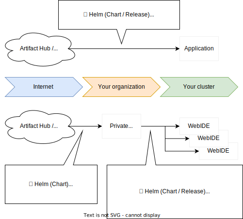

# COSMO Template Engine

As COSMO manages Workspaces in Kubernetes cluster, it is designed to replicate of Kubernetes resources from the set of Kubernetes manifests in cluster.

We call this feature as COSMO Template Engine and it is built with Kubernetes CRD `Template` and `Instance`.

The set of Kubernetes manifests is defined `Template` and the created Kubernetes resources from the `Template` is called `Instance`

`Template` is just a set of Kubernetes YAML manifests.

`Instance` has a reference to a Template, and the COSMO Controller running in the cluster creates and keeps the actual Kubernetes resources in sync with the Template for the life of the Instance.

COSMO Template engine is picking the best of both variable-based [`Helm`](https://helm.sh) and overlay-based [`Kustomize`](https://github.com/kubernetes-sigs/kustomize).

### Differences with Helm

A feature to create resources from templates may bring to mind Helm, which is already well known as a package manager in the Kubernetes ecosystem.

Actually COSMO Template is similar to helm template but Helm is specific to distribute in various environment or clusters as a package manager.

In helm template, all environment-dependent properties are defined as variables and `if-else` statements in order to generate manifests which are sutable for all usecases or environments. 
(e.g. especially network and storage configurations are required everytime.)

`COSMO Template` is not targeting to distribute Template in various environment or clusters but only to replicate Template 
 or create instances(hundreds of or more) in a single cluster.

To create a COSMO Template, simply overwrite a portion of the manifest that is already running or make it a variable. The goal is to replicate it within the cluster.

Therefore, we are not competing with Helm but complement.

You can download useful Helm charts from public repositories, configure your environment settings, and distribute them for each developer as COSMO Templates in your cluster.

It is expressed as a diagram as follows.



## Template

`Template` is a collection of normal Kubernetes YAML manifests.

You can include any kind of manifests.

```yaml
apiVersion: cosmo-workspace.github.io/v1alpha1
kind: Template
metadata:
  name: nginx
spec:
  requiredVars:
    - var: '{{IMAGE_TAG}}'
      default: latest
    - var: '{{NUMBER_OF_PODS}}'
  rawYaml: |
    apiVersion: v1
    kind: Service
    metadata:
      labels:
        cosmo-workspace.github.io/instance: '{{INSTANCE}}'
        cosmo-workspace.github.io/template: nginx
      name: nginx
      namespace: '{{NAMESPACE}}'
    spec:
      ports:
      - name: main
        port: 80
        protocol: TCP
      selector:
        cosmo-workspace.github.io/instance: '{{INSTANCE}}'
        cosmo-workspace.github.io/template: nginx
      type: LoadBalancer
    ---
    apiVersion: apps/v1
    kind: Deployment
    metadata:
      labels:
        cosmo-workspace.github.io/instance: '{{INSTANCE}}'
        cosmo-workspace.github.io/template: nginx
      name: nginx
      namespace: '{{NAMESPACE}}'
    spec:
      replicas: '{{NUMBER_OF_PODS}}'
      selector:
        matchLabels:
          cosmo-workspace.github.io/instance: '{{INSTANCE}}'
          cosmo-workspace.github.io/template: nginx
      template:
        metadata:
          labels:
            cosmo-workspace.github.io/instance: '{{INSTANCE}}'
            cosmo-workspace.github.io/template: nginx
        spec:
          containers:
          - image: 'nginx:{{IMAGE_TAG}}'
            name: nginx
            ports:
            - containerPort: 80
              name: main
              protocol: TCP
```

### Template Variables
Template has variables. It is a minimal feature for text-based YAML replacement, so that you do not need to understand the detailed syntax.

Variables are defined as UPPERCASE letters + underscores (A-Z_) enclosed in `{{` and `}}`.
And it will be replaced when a `Instance` is created from the Template. 

There are 2 types of variables, pre-defined variables and user-defined variables.

The pre-defined variables are only as follows.

| Variables     | Description                           |
|:--------------|:--------------------------------------|
| {{INSTANCE}}  | Instance name                         |
| {{NAMESPACE}} | Namespace name in which instance runs |

In the example Template, `{{IMAGE_TAG}}` and `{{NUMBER_OF_PODS}}` are user-defined variables.

A user-defined variable in `requiredVars` are checked to be specified in `Instance` when creating Instance.

### Resource name prefix
All of the resource name (.metadata.name) including Template will be prefixed with `{{INSTANCE}}-`. 

In the example template, deployment name created by instance named `example` is `example-nginx'`.

> Note:
> Currently, name prefix feature is not the same as kustomize, which change the name and the references.
> So the Template generated by `cosmoctl tmpl gen` command use kustomize internally and have `{{INSTANCE}}-` prefix on all manifests by default.

In order not to prefix on resources, set `cosmo-workspace.github.io/disable-nameprefix: "true"` in annotation of Template.

## Instance

`Instance` replesents the actual collection of Kubernetes resources based on a `Template`.

In other words, when you create `Instance`, the Kubernetes manifests defined in `Template` will be generated and applied to the cluster.

An example of Instance using `nginx` Template.

```yaml
apiVersion: cosmo-workspace.github.io/v1alpha1
kind: Instance
metadata:
  name: my-nginx1
  namespace: default
spec:
  template:
    name: nginx
  vars:
    IMAGE_TAG: alpine
  override:
    patchesJson6902:
    - target:
        apiVersion: v1
        kind: Service
        name: nginx
      patch: |
        [
          {
            "op": "replace",
            "path": "/spec/type",
            "value": "NodePort"
          }
        ]
```

### Lifetime of Instance
Each resources will be created based on `nginx` Template with a OwnerReference of the Instance . 
By deleting the Instance, all resources created by Instance will be automatically deleted by OwnerReference.

If the Template is changed, it will be dynamically applied to the running resources.

### Vars
`vars` is a key-value Map of the user-defined variables in Template.

Pre-defined Template variables and user-defined variables defined in `vars` will be replaced before applying to Kubernetes.

### Override
Override is one of the most important features of Instance, which supports dynamic change of Template.

Currently, `patchesJson6902` in [RFC6902](https://www.rfc-editor.org/rfc/rfc6902.html) format is supported.

## Generate Template

Template can be generated via `cosmoctl`.

All you have to do is to prepare your own Kubernetes YAMLs that is deployable.

And pass them to `cosmoctl tmpl gen` command by stdin.

```sh
# kustomze
kustomize build . | cosmoctl tmpl gen

# helm template
helm template RELEASE CHART | cosmoctl tmpl gen
```

Command option

```
-h, --help                                      help for generate
-n, --name string                               template name (use directory name if not specified)
-o, --output string                             write output into file (default: Stdout)
    --desc string                               template description
    --required-vars strings                     template custom vars to be replaced by instance. format --required-vars VAR1,VAR2:default-value
    --cluster-scope                             generate ClusterTemplate (default generate namespaced Template)
    --disable-nameprefix                        disable adding instance name prefix on child resource name
    --userroles strings                         user roles to show this template (e.g. 'teama-*', 'teamb-admin', etc.)
    --required-useraddons strings               required user addons
    --workspace                                 template as type workspace. see detail in `WORKSPACE.md`
    --useraddon                                 template as type useraddon. see detail in `USER.md`
```

## Template Annotations

Template with the following annotations have special behavior.

| Annotatio keys | Avairable values(default) | Description | cosmoctl option |
|:--|:--|:--|:--|
| `cosmo-workspace.github.io/disable-nameprefix` | `["true", "false"]`("false") | UserAddon with this annotation is applied to all Users automatically | `--disable-nameprefix` |
| `cosmo-workspace.github.io/userroles` | comma-separated UserRoles(None) | User who use this Template must have all of the UserRoles specified in this annotation | `--userroles` |
| `cosmo-workspace.github.io/required-useraddons` | comma-separated UserAddon names(None)  | User who use this Template must be attached all of the UserAddons specified in this annotation | `--required-useraddons` |
